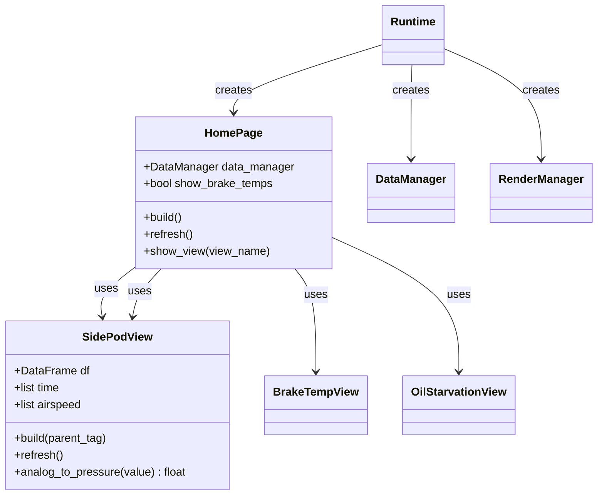

# Telemetry Application Architecture

This diagram shows how the main classes interact.

```mermaid


classDiagram
    class HomePage {
        +DataManager data_manager
        +bool show_brake_temps
        +build()
        +refresh()
        +show_view(view_name)
    }

    class SidePodView {
        +DataFrame df
        +list time
        +list airspeed
        +build(parent_tag)
        +refresh()
        +analog_to_pressure(value) float
    }

    
    Runtime --> HomePage : creates
    Runtime --> DataManager : creates
    Runtime --> RenderManager : creates

    HomePage --> SidePodView : uses
    HomePage --> BrakeTempView : uses
    HomePage --> OilStarvationView : uses
    HomePage --> SidePodView : uses

```